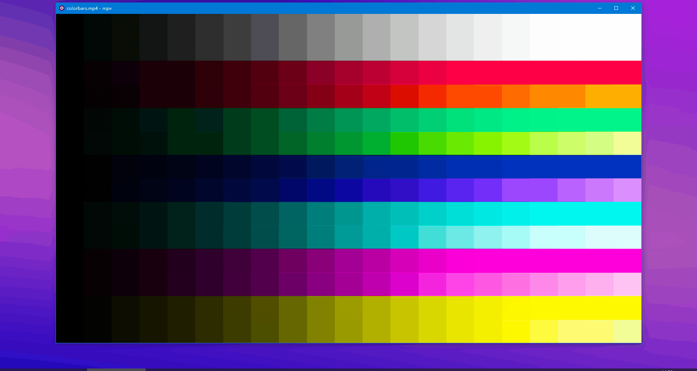

# mpv Picture-in-Picture

## 语言
[English](README.md)

[简体中文](README_zh.md)

## 简介
实现mpv播放器画中画功能，仅限于Windows平台，基于luajit调用win32api实现。



## 安装
- 提醒: mpv需要有luajit，推荐 [shinchiro/mpv-winbuild-cmake](https://github.com/shinchiro/mpv-winbuild-cmake/releases) 和 [zhongfly/mpv-winbuild](https://github.com/zhongfly/mpv-winbuild/releases) 。
- `pip.lua`放在`~~/scripts`目录，`pip.conf`放在`~~/scripts-opts`目录，通常如下图所示：
    ```
    .../mpv/
       │  ...
       └─ /portable_config/
          ├─ /scripts/
          │    pip.lua
          ├─ /script-opts/
          │    pip.conf
    ```
## 使用
可在`pip.conf`中自定义 快捷键、窗口大小、窗口对齐方式。\
如果你使用了 [--no-input-default-bindings](https://mpv.io/manual/stable/#options-no-input-default-bindings) 选项，则需要自己在`input.conf`中自定义快捷键：
```
KEY script-binding pip/toggle
```

## 在其他脚本中集成
```lua
-- 查询画中画是否开启
local pip_is_on = mp.get_property_bool('user-data/pip/on', false)
-- 开启、关闭、切换 操作
mp.commandv('script-message-to', 'pip', 'on')
mp.commandv('script-message-to', 'pip', 'off')
mp.commandv('script-message-to', 'pip', 'toggle')
```

